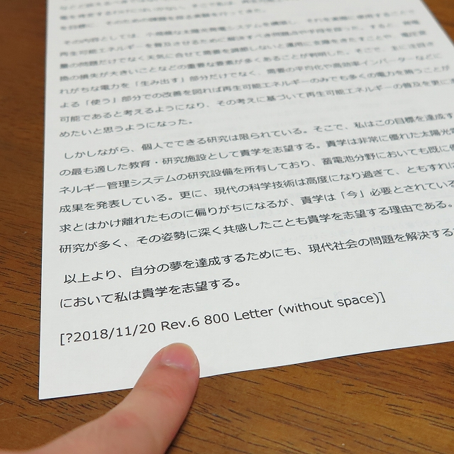
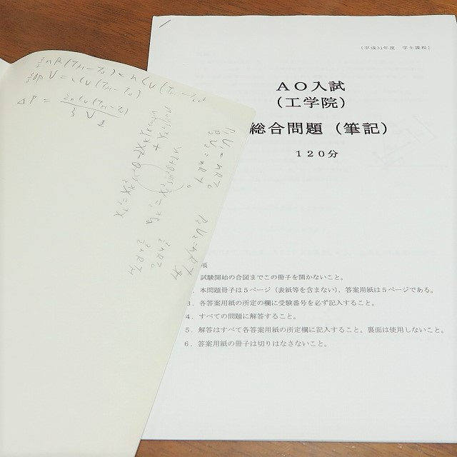

現在は「総合型選抜」という名前になっているようですが、筆者はその前身にあたるAO入試で合格し、2019年度に東工大工学院に入学しました。筆者がAO入試を受験した際、特に**AO入試関連の情報が非常に少なく、不安だった**経験があるので、今回はAO入試がどんな感じであったかを振り返りつつ、これから東工大を目指す方々に向けてのアドバイスをしていけたらと思います。

> *注意*
> 本ページはあくまで筆者の経験を基にしたものであり、最新の情報を反映したものではないことに注意してください。また、特にAO入試は試験結果の詳細が明確でない部分が多く、筆者の想像で語っている部分も多いため参考程度にご覧ください。

## とにかく「謎」な試験内容

東工大のAO入試は、今は「総合型選抜」という名前に変わっていることからもわかるように**試験内容が割と頻繁に変更されます**。そもそも情報が少ないうえに内容が変更されるので一体どのような試験が行われるのか、よくわからないまま入試に挑むことになります。筆者が受験した際(2019年度)は

* 志望理由を提出させられるけど**それが評価に影響するのかはよくわからない**

* (人数が多いときは)センター試験で第１段階選抜を行うけど**例年のボーダーが何点くらいなのかはよくわからない**

* 試験は筆記と面接だけど**出題内容がよく変更されるので対策が難しい**

という感じで、とにかく**わからにことだらけ**でした。というわけで、(2019年度の情報にはなりますが)それぞれが実際はどんな感じだったのかをまとめます。

### 志望理由

志望理由は出願時に専用の紙に手書きで提出させられました(写真はピッタリ800文字にした志願理由の下書き。修正を６回行ったことが分かる)。募集要項を見ても「筆記＋面接で100点」としか書いていないのでこの志望理由が入試結果に影響するのかは正直よくわかりませんが、かといって適当に書くわけにもいきません。ということで筆者はPCで下書きを書き、**高校の国語教師に繰り返し添削をしてもらいました**。正直添削してもらうのは勇気が必要ですが、**自分では気づかなかったことに気づけるので必ず第三者に見てもらいましょう**。最終的に6回の校正を行い、無駄に**指定された上限の文字数ぴったりにして**提出しました。

内容は、**過去に取り組んできたことを、嘘は書かずともちょっと大げさに表現する**という方針で書きました。例えば、筆者の場合は単に既製品を組み合わせて太陽光発電をして遊んだ経験を**太陽光発電システムを自作することでエネルギー問題の解決策を考えた**という風にちょっと大げさな感じで書きました。でも、**嘘はついてないのでOKです**。

### 第１段階選抜

第１段階選抜はセンター試験900点満点の点数で機械的に評価されます。幸いにも東工大受験生はそこまでセンターの平均点が高くないこと、および筆者が **「センターは満点を目指すもの」というような非常に厳しい環境にいたこと**から900点中768点で第１段階選抜を通過。具体的にボーダーが何点なのかは謎なままです。

### 試験前日

結局、AO入試の対策はよくわかないまま試験前日に。筆者は兵庫県出身ですので前日から東京へ。元々は飛行機で速攻で行ってやろうと思っていたのですが**朝から雪が降り、欠航となる可能性がある**とのことだったので当日朝に新幹線へと急遽変更。ちょっと不安でしたが無事東京に到着。東京でも割と雪でが降っていたので、大井町のホテルの窓から降りしきる雪を見ながら不安な１日を過ごすことに。前日は「東工大のどこがいいの？」みたいな質問をされても答えられるように東工大について調べていました。まあ、結果的に意味はなかったですが。

### 筆記試験

そして迎えた試験当日、まずは筆記試験からです(写真は実際の筆記試験問題と計算用紙。ほとんど計算用紙を使わなかったことが分かる)。試験会場は西２・３号館(第１食堂前の古い建物)。試験問題は主に数学と物理。**「ベクトルの内積が0なので直角です」**というような、当たり前すぎて逆に迷うような問題も出題されたので冷静に考えて簡潔に説明を書くように心がければよいと思います。筆者はいかんせん**理系が苦手**なので一部わからない問題もありましたが、8割くらいは合っているかな、といった感じでした(詳細な点数は分からないので実際は不明)。**平均点はかなり高い**と思われるので、難しい問題を解く能力というよりもいかに**冷静に、かつ理論的に説明できるか**にかかっていると思います。

### 休憩時間

次は面接ですが、その前に昼休憩です。筆者は「今さら対策のしようがない」と言いながら本館の周りをぶらついていた結果、**ウッドデッキが凍結していて思いっきり「滑り」ました**。というわけで皆さんは座って静かに休憩しましょう。

### 面接試験

面接試験は石川台地区で行われたので、本館横から大移動です。試験官を先頭として**小学生の遠足がごとく受験者みんなで移動**しました。移動先で初めて面接の詳細が告げられます。具体的には、

* 最初の３分で自己アピール
* そのあと、問題が渡されるので７分で説明を考えて5分以内で説明

といった感じです。しかも、面接の順序も同時に発表されたのですが、筆者はなんと**2番目**でした。待ち時間が少ないので自己アピールを考える時間も少なかったですが、何とか落ち着いて話す内容をまとめました。

#### 自己アピールは「堂々と」

センター試験でも緊張感が一切なかった筆者ですが、さすがに面接となると緊張しますが心を決めて試験室をノックし、入室。そこには~~仏頂面のオッサン~~一切笑わない試験官３人と、卓上にはデカいデジタル時計。そして微妙に離れたところに長机と椅子が１組置かれていました。大人３人に対して高校生１人、その空気感は一言で言うなら**絶望**です。

まずは自己アピールから、ということで３分間のタイマーがセットされました。心を無にして先ほど考えた自己アピールを発表します。ここで大事なのは**謙遜**や**緊張**という感情を捨て去り、**自信をもって発表すること**です、当然ですが自身なさげな自己アピールはもはや「自己アピール」とは呼べませんから。筆者はうつむかないように必死で**試験官のほうを見ながら**、**語尾は必ず「ですます調」ではっきりと言い切る**ことを徹底しました。その結果、時間が１分残りましたが**気にせず自信満々に「以上です」と述べて強制終了**させました。

また、自己アピールの発表内容はおおよそ志願理由と同じとし、「今まで何をしてきたか」「なぜ東工大に入りたいのか」という二点を主題に置きました。

#### 問題の説明はやらかしても自信満々に

次に、試験官から問題とボールペンを手渡され、その問題につて７分間で説明を考え、５分以内でそれを説明します(写真は実際に手渡された東工大オリジナル3+1色ボールペン。ペンは持ち帰ることができるので記念品になる。)。問題は確か「磁場中に打ち出された電子の運動」といった、かなり基礎的なものでしたが**とても冷静に考える余裕はありませんでした**。後ろには模造紙が貼られており、そこに説明用の図を記入するのですが**手が震えてまともにかけたものではありませんでした**。そんな「問題の答えはあやふや」＋「図もできていない」という絶望的な状況ですが、無情にも7分間はあっという間に過ぎていきます。

状況は最悪ですが、最善を尽くすしかありません。というわけで筆者はここでも**とにかく自信満々に説明すること**を心がけました。具多的には**どんなに自信がなくてもはっきりと言い切ること**、および正しいかどうかを一旦無視して必ず **「～なので～となると考えられます」というように理由を述べること**を徹底しました。正直グダグダでしたが **「おそらく」といったあやふやなことは一度も言いませんでした**。

## 受験勉強「以外」も大事

面接試験の後は一部屋に集められ、全員が終わるまで待機したのち終了となりました。正直「やらかしたな～」と思いながら帰路につき、一般入試に向けて学習を再開しましたが２日後の合格発表で無事合格。筆者の友人は大学合格時に嬉しさのあまり廊下の端から端まで全力疾走したとか言っていましたが、筆者は**淡々と入学金を払いに行きました**。

結局、筆者がなぜ合格できたのかは詳細な点数が公開されないので謎なままです。単に**面接の順序が早かったので優遇された**という可能性だってあります。しかしながら、次の二つのことは受験生の皆さんにはっきりとアドバイスすることができます。

まず一つ目に、**いわゆる「受験勉強」以外のことも重要**ということです。特にAO入試のような試験では「単に成績がいい人」を求めているわけではありません。筆者の場合は**半ば趣味で電気工事士や基本情報技術者といった国家資格を取得**していたり、**家の屋根に太陽光パネルを乗っけてみたり**と様々な経験があったからこそ**明確な志願理由を述べることができました**。なので、特にこれから受験生になるという方には**様々なことに挑戦してほしい**です。まあ、筆者の場合は単に成績の低さを何とか補っただけとも言えますが(物理と数学は欠点だった)。

そして二つ目は**面接で謙遜しても悪影響しかない**ということです。ついつい謙遜したくなりますが、当然ながら面接で**自信なさげな人を採用したいとは誰も思わない**でしょうから、面接にはとにかく自信を持って(あるいは自信があるように「繕って」)望みましょう。

### LANDFALLについて

このブログは、東工大の学生サークル「[LANDFALL](https://landfaller.com)」の部員が執筆しました。

LANDFALLは、学生のための情報冊子を作成しているサークルです。

主な制作物は、毎年新入生に配布している「[TOKO WALKER](https://landfaller.com/7a895fee2b767b2554cee0ff6a428902/TOKOWALKER2021.pdf)」という冊子です。新入生が大学生活のスタートダッシュを切ることができればとの想いで制作しています。

また、LANDFALLは[研究室紹介記事](https://landfaller.com/magazines)も作成しております。「LANDFALL」は研究室紹介冊子として1986年に創刊され、現在92号まで発行されています。オンラインで記事を公開しておりますので、ぜひご覧ください。

また、この記事を読んだ受験生の皆様が東工大に入学した際には、是非[LANDFALLの部室](https://landfaller.com/blogs/clubroom/)にもお越しください。