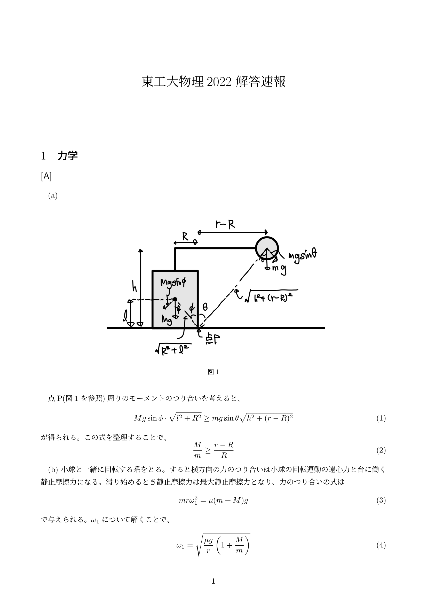
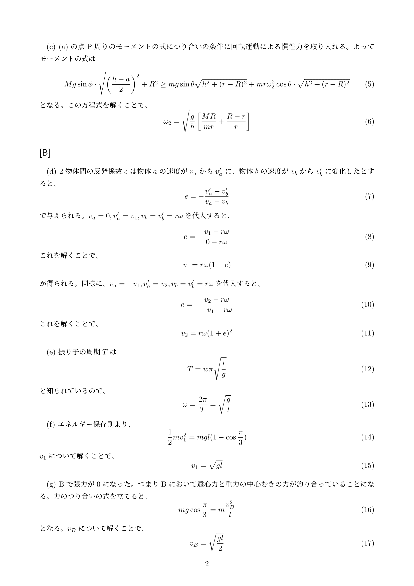
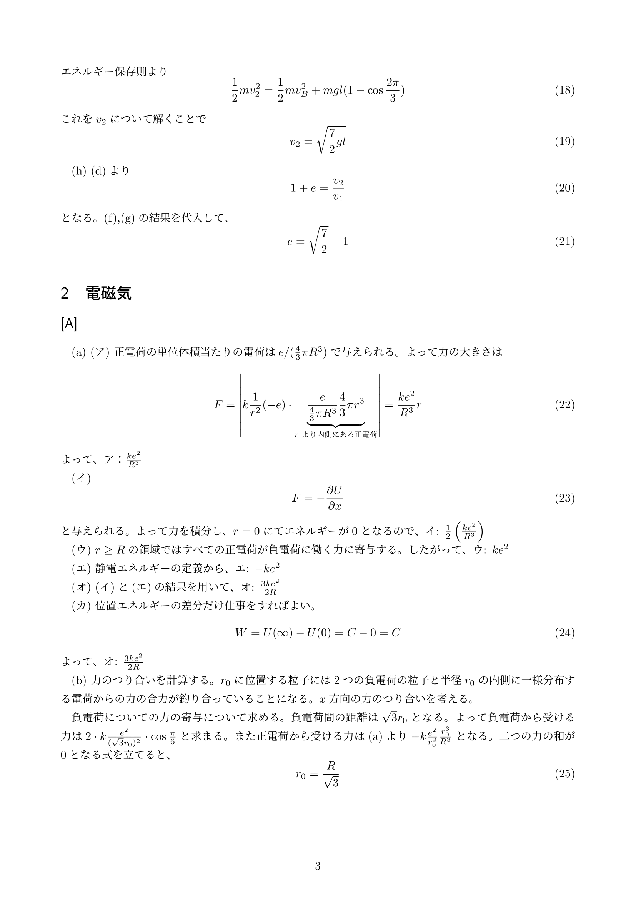
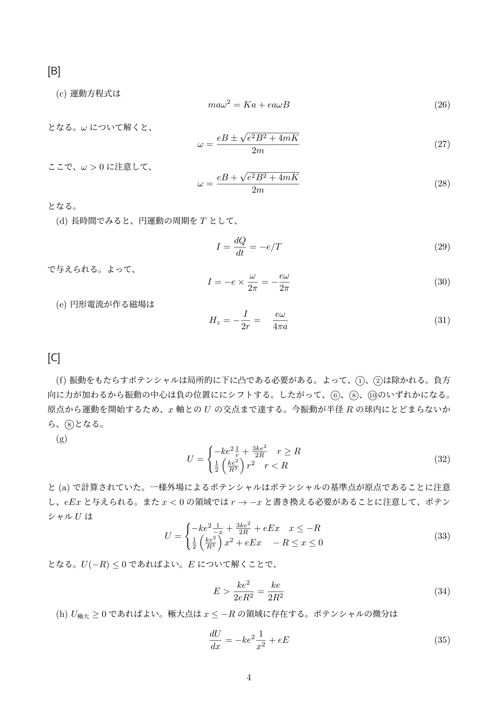
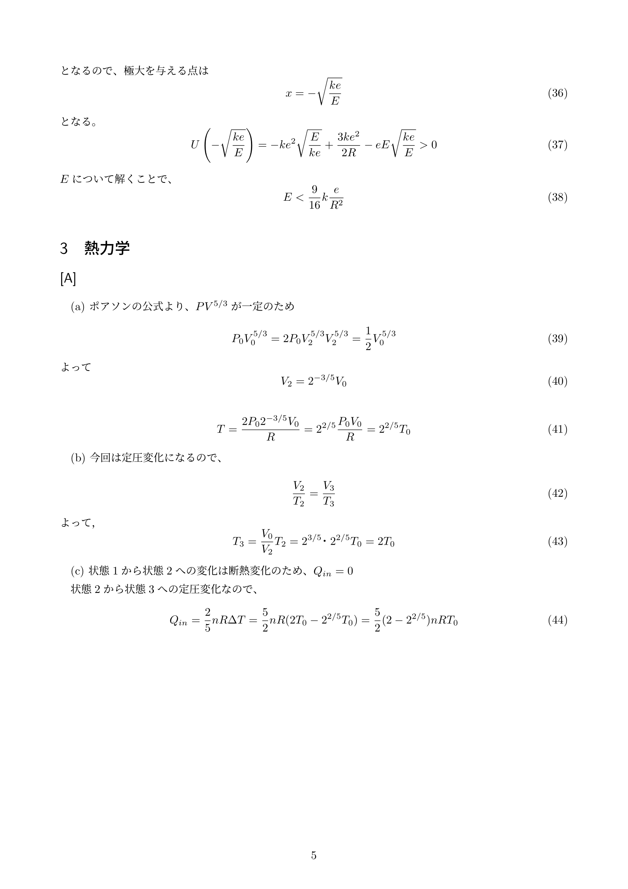
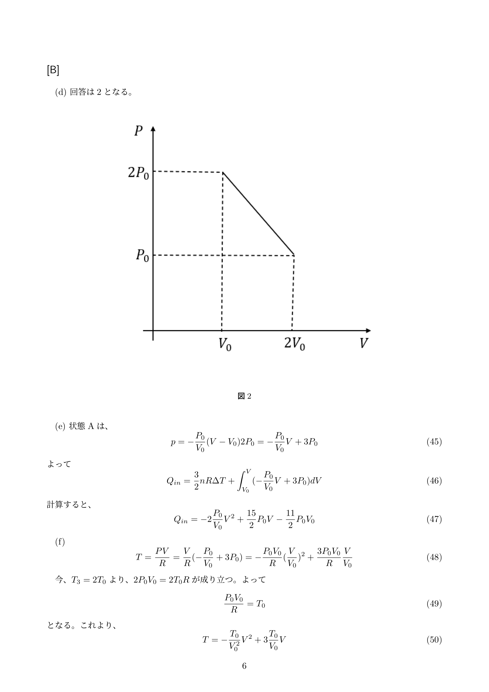
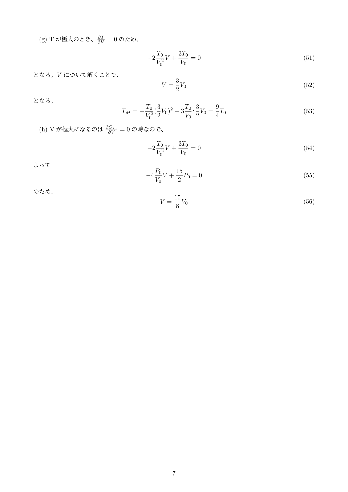

LANDFALL編集委員のJです。
受験生のみなさん、大学入試本当にお疲れ様でした。きっとこれまで費やしてきた努力がすばらしい結果として現れてくるすることと思います。今日2月27日はきっとお家だったりどこかでゴロゴロしてこれまでの疲れをいやしていることと思います。

私も3年前東工大の入試を受け、なんて難しい試験なんだって思いすごいがっくりしていました。特に物理に関してはすごいトラウマがありまして、試験問題に書かれている文字を一つ読み落として、大問一つをほとんど解けないということをやってしまいました。それに気づいたときは本当に絶望しました。

入試で散々な目にあっているのにも関わらず、どういうわけか私は現在、物理学科に流れ着いてしまいました。今回はLANDFALLの新歓ということを兼ねて、入試問題の解答を作成しようということになり、物理学科の私が物理の問題を担当することになりました。。ですが前述のとおりそれほど問題を解く力があるわけでもなく、ぼんやりと大学生活を送ってきた関係で数式処理能力も受験生の皆さんの足元にも及ばない程度に落ちていることと思います。そのためあんまり頼りにならないかもしれません。そこのところは申し訳なく思います。。間違えを発見されましたら，連絡していただけると助かります。

## 解答速報

PDFのリンクは以下から飛ぶことができます．
[東工大2022物理　解答速報PDF](https://landfaller.com/publication/blogs/20220227/2022.pdf)

## LANDFALLについて

このブログは、東工大の学生サークル「[LANDFALL](https://landfaller.com)」の部員が執筆しました。

LANDFALLは、学生のための情報冊子を作成しているサークルです。

主な制作物は、毎年新入生に配布している「[TOKO WALKER](https://landfaller.com/7a895fee2b767b2554cee0ff6a428902/TOKOWALKER2021.pdf)」という冊子です。新入生が大学生活のスタートダッシュを切ることができればとの想いで制作しています。

また、LANDFALLは[研究室紹介記事](https://landfaller.com/magazines)も作成しております。「LANDFALL」は研究室紹介冊子として1986年に創刊され、現在92号まで発行されています。オンラインで記事を公開しておりますので、ぜひご覧ください。

また、この記事を読んだ受験生の皆様が東工大に入学した際には、是非[LANDFALLの部室](https://landfaller.com/blogs/clubroom/)にもお越しください。