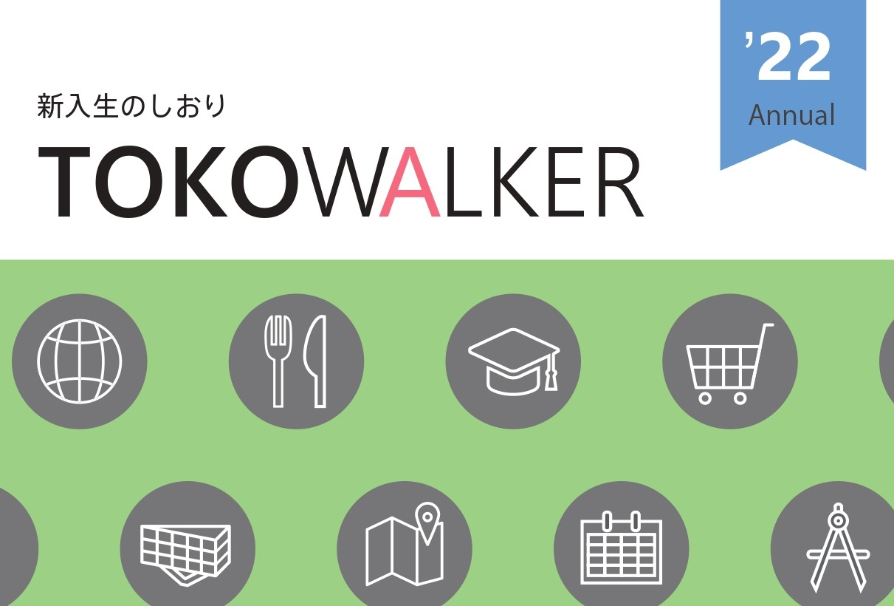

今年もTOKOWALKERが完成しました。2022年のTOKOWALKERのPDFを見れるようにしました。

## 目次

- [**ご挨拶**](./pdf/TOKOWALKER_最終版v3-14-2_compressed.pdf)
- [**これからの予定**](./pdf/TOKOWALKER_最終版v3-14-4-7_compressed.pdf)
    - はじめに
    - 入学式
    - 1年間の流れ
- [**キャンパス案内**](./pdf/TOKOWALKER_最終版v3-14-8-13_compressed.pdf)
    - 大岡山周辺マップ
    - 大岡山キャンパスマップ
    - すずかけ台キャンパスマップ
    - 付属図書館に行ってみよう
- [**生協を利用しよう!**](./pdf/TOKOWALKER_最終版v3-14-14-22_compressed.pdf)
    - 大岡山第一食堂
    - 大岡山第二食堂
    - すずかけ台食堂
    - 学食パスのご案内
    - 大岡山購買
    - すずかけ台購買
    - 生協について
    - 総代になろう
    - 共済に加入しよう
- [**授業等紹介**](./pdf/TOKOWALKER_最終版v3-14-23-29_compressed.pdf)
    - 単位について
    - 学院紹介
    - 授業紹介
- [**大学生活**](./pdf/TOKOWALKER_最終版v3-14-30-43_compressed.pdf)
    - 東工大用語集
    - オンライン授業について
    - 工大祭
    - カウンセラーの紹介
    - 学生相談室の紹介
    - アルバイト案内
    - 飲酒について
    - サークルについて
    - 免許をとろう
- [**編集後記**](./pdf/TOKOWALKER_最終版v3-14-51_compressed.pdf)

## LANDFALLについて

このブログは、東工大の学生サークル「[LANDFALL](https://landfaller.com)」の部員が執筆しました。

LANDFALLは、学生のための情報冊子を作成しているサークルです。

主な制作物は、毎年新入生に配布している「[TOKO WALKER](https://landfaller.com/7a895fee2b767b2554cee0ff6a428902/TOKOWALKER2021.pdf)」という冊子です。新入生が大学生活のスタートダッシュを切ることができればとの想いで制作しています。

また、LANDFALLは[研究室紹介記事](https://landfaller.com/magazines)も作成しております。「LANDFALL」は研究室紹介冊子として1986年に創刊され、現在92号まで発行されています。オンラインで記事を公開しておりますので、ぜひご覧ください。