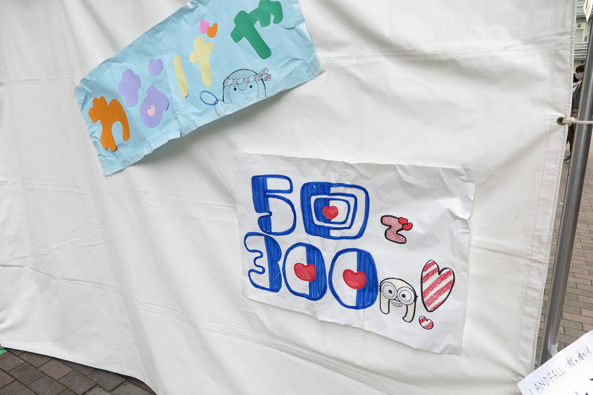
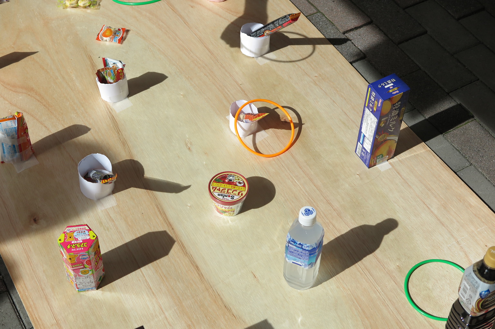
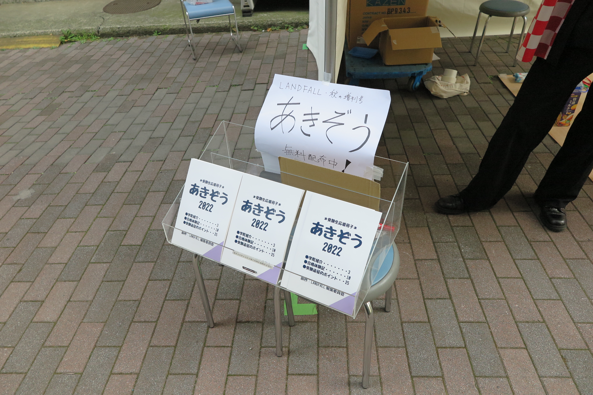

東工大の学園祭こと"工大祭"が4年ぶりに対面で開催され、弊団体も企画として輪投げの屋台を出店するとともに、受験生応援雑誌「あきぞう」を頒布しました。
~~(雑誌を作る団体なのになんで輪投げ？と思うかもしれませんが、楽しければなんでもOKです)~~ 

今回は、工大祭でのLANDFALLの活動の様子を振り返ります。

## 企画の内容を決めよう！！

対面での工大祭が4年ぶり...というわけでお察しの方もいると思いますが、今回の工大祭が**学部一年生から四年生まで全員にとって初めての対面開催**という異例の事態でした。
そのためどこの団体も手探りで企画準備を進めていたわけですが、LANDFALLもどんな企画をするか？ということで話し合いを重ねました。

出てきた案を挙げてみると…

> * 食品販売（ラーメン・ワッフル等）
>
> * くじ引き
>
> * ダーツ
>
> * **気配切り** (棒を持った人が目隠しをして、気配を察知してターゲットを叩く遊び。やや野蛮?）
>
> * ローリングコインタワー ([某男性アイドルグループの番組](https://ja.wikipedia.org/wiki/VS嵐 )で行われていたゲーム)

...といった感じで、遊びやゲームなどの体験して楽しめる企画の案が多かったです。

そんな中で選ばれたのが**輪投げ**でした。
過去にLANDFALLの先輩方が実施していたということや、小さい子でも楽しめるいかにも縁日らしい遊びであるということが決め手となりました。

## 楽しい「わなげや」

夏休みに輪投げ屋を出店することが決まってからコツコツと準備を進めて、ついに工大祭当日となりました！
実際の屋台の様子は以下のようになります。

輪投げの難易度ですが、手前の方の景品はお子様でも容易に獲得でき、奥の方の景品は割と簡単...に見えて意外と難しい！という**もどかしい難易度**を実現できました。

工大祭が始まった直後はお客さんが来てくれるか不安でしたが、小さなお子様を中心として徐々に来客者数が増えていき結果的には**1日目・2日目ともに準備していた景品が完売**しました！
来客者数は二日間合計で**214人**（重複込み）でした。かなり多くのお客様に来ていただけたと思います。

#### 「わなげや」に足を運んでくださった皆様、ありがとうございました!!

## 本業も忘れずに~受験生応援冊子「あきぞう」~

輪投げが楽しくて忘れてしまうところでしたが、私たちLANDFALLは研究室紹介冊子や新入生向けの冊子を作ることを主な活動としています。
今年度は学園祭に足を運んでくれた東工大志望の受験生に向けて、**「受験生応援冊子 あきぞう 2022」**を頒布しました。あきぞうとは「秋の増刊号」の略です。（多分。）

あきぞうには、東工大の各学院で学べることやLANDFALLの編集委員による合格体験記、地方からはるばる東京まで受験しに来る際の注意点など、東工大受験で欠かせない内容が収録されています。

今年度はあきぞうを130部印刷しました。サポートセンターとわなげやの屋台で頒布して、**すべて配布することができました**！！あきぞうは以下のページからアクセスできます。もしよかったらこちらもどうぞ。

[あきぞう](/blogs/akizou2022/)

**わなげやもあきぞうも大成功の工大祭でした～**

---
### LANDFALLについて

このブログは、東工大生協の学生委員会の団体「[LANDFALL](https://landfaller.com)」の部員が執筆しました。

LANDFALLは、学生のための情報冊子を作成している学生団体です。

主な制作物は、毎年新入生に配布している「[TOKO WALKER](https://landfaller.com/7a895fee2b767b2554cee0ff6a428902/TOKOWALKER2021.pdf)」という冊子です。新入生が大学生活の良いスタートダッシュを切ることができればとの想いで制作しています。

また、LANDFALLは[研究室紹介記事](https://landfaller.com/magazines)も作成しております。「LANDFALL」は研究室紹介冊子として1986年に創刊され、現在93号まで発行されています。オンラインで記事を公開しておりますので、ぜひご覧ください。

また、この記事を読んだ受験生の皆様が東工大に入学した際には、是非[LANDFALLの部室](https://landfaller.com/blogs/clubroom/)にもお越しください。