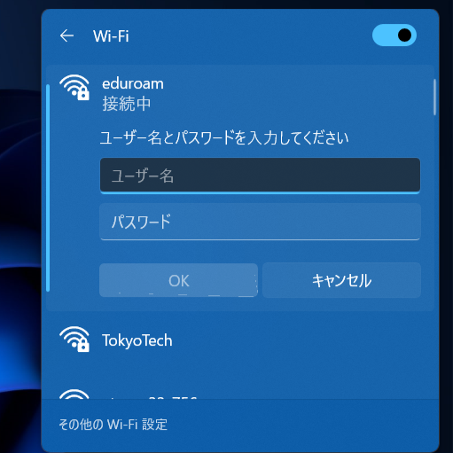

# 東工大Wi-Fiのログインが面倒？→ eduroamで自動接続！
 
## 毎回ログインしてませんか？

お久しぶりです、LANDFALL編集部員の上田です。

東工大キャンパス内では、かなり広い範囲で学内Wi-Fi「**TokyoTech**」が使えます。こいつはかなり高速で、かつエリアも広いので便利なのですが一つ大きな欠点があります、それは**毎回ログインが必要**ということ。これ、皆さんも面倒だなと感じているのではないでしょうか。

そこで今回は、国際的なWi-Fiローミングサービスの**eduroam**を使うことでPCでもスマホでもログイン不要で学内Wi-Fiを使えるようにする方法を紹介します。これを使えば東工大のみならず、**世界中の学内Wi-Fiに自動接続される**ので非常に便利です。

## 世界中の大学Wi-Fiに自動接続！

eduroamというのは世界中の大学や研究機関のWi-Fiサービスを相互利用できるようにするサービスで、東工大もこれに加盟していて東工大Wi-Fiの使える範囲内で使用することができます。

こんな感じで東工大Wi-Fiが使える場所であればeduroamというWi-Fiも飛んでいるのですが、これは「802.1X認証」という認証が使え、**認証を自動化できる**ので今回はこちらに接続していきます。ただし、接続には専用のアカウントが必要なのでまずはアカウント作成作業を行います。

まず**eduroamアカウント**の発行が必要なので[eduroam JP 認証連携IDサービス](https://federated-id.eduroam.jp/)のページにアクセスし、所属機関で「東京工業大学」を選択します。

すると、東工大ポータルにログインするよう求められ、ログインすると「学認」サービスを使って自動的にeduroamに東工大アカウントの情報が転送され…

なぜか私の環境では戻るボタンを押していないのに「戻るボタンを使っただろ！」とか言われて**途中で止まってしまう**のですが、この状態で気にせず「戻る」を押してもう一度所属機関選択に戻り、再び東工大を選ぶと進めました。なんか見えちゃいけないものが見えているし、 ~~さすが東工大クオリティー~~

ちょっとトラブりましたがこれで東工大ポータルのログイン情報がeduroamに送信され、eduroamとの連携が完了します。

こちらがeduroamのメニュー画面、ここからeduroamアカウントを作成します。認証方法は**ID/パスワード方式**と証明書による**EAP-TLS認証**の２つがあり、どちらでも自動ログインが可能です。個人的には証明書認証のほうがおすすめですがまずは簡単なID/パスワード方式でログインしてみます。

先程のメニュー画面から一番上の「**新規ID/Passwordアカウント発行**」を選んで進めていくと、こんな感じで有効期限選択ページになります。有効期限が来るたびに新しいアカウントを作成しなおす必要があるのですが、面倒なので私は最長の**3か月**にしています。

すると、アカウントが発行されてIDとパスワードが表示されます。

このIDとパスワードをPCやスマホのWi-Fi接続時に入力すれば接続完了です。この資格情報を保存するように設定しておけば**次回以降は自動的に接続**されるので以降は(アカウントの期限が切れるまでは)大学構内に行くだけで勝手にWi-Fiにつながります。

これで目標達成…なんですが、最初だけとはいえかなり長いIDとパスワードを様々な機器に入力するのは面倒ですよね。

## 証明書認証を使う理由

そこで登場するのが802.1Xによる**証明書認証**です。これはID/パスワードの代わりにPCやスマホに証明書をインストールし、それによって認証を行います。まずはメニュー画面から「**新規証明書[EAP-TLS]アカウント発行**を選び、証明書アカウントを作成します。

すると、こんな感じで証明書ファイルをダウンロードできるようになるので、これを使いたい機器にダウンロードし、インストールすればIDやパスワードを入力しなくてもWi-Fiにログインできるようになります。

インストールの方法は[eduroamのHP](https://federated-id.eduroam.jp/guide/install.php)で機器ごとにわかりやすく解説されているのでそちらを確認してください(決してまとめるのが面倒になったわけではない)。

なお、証明書認証を使っても結局証明書インストール時に証明書のパスワードを求められるので手間はほぼ変わらない、というかなんなら**手間が増えただけ**というのが現実です。じゃあなぜ証明書を使うのか、それは**証明書認証を使ってみたかったから**です。

---
## LANDFALLについて

このブログは、東工大生協の学生団体「[LANDFALL](https://landfaller.com)」の部員が執筆しました。

LANDFALLは、学生のための情報冊子を作成しているサークルです。

主な制作物は、毎年新入生に配布している「[TOKO WALKER](https://landfaller.com/category/tokowalker/)」という冊子です。新入生が大学生活のスタートダッシュを切ることができればとの想いで制作しています。

また、LANDFALLは[研究室紹介記事](https://landfaller.com/magazines)も作成しております。「LANDFALL」は研究室紹介冊子として1986年に創刊され、現在93号まで発行されています。オンラインで記事を公開しておりますので、ぜひご覧ください。
