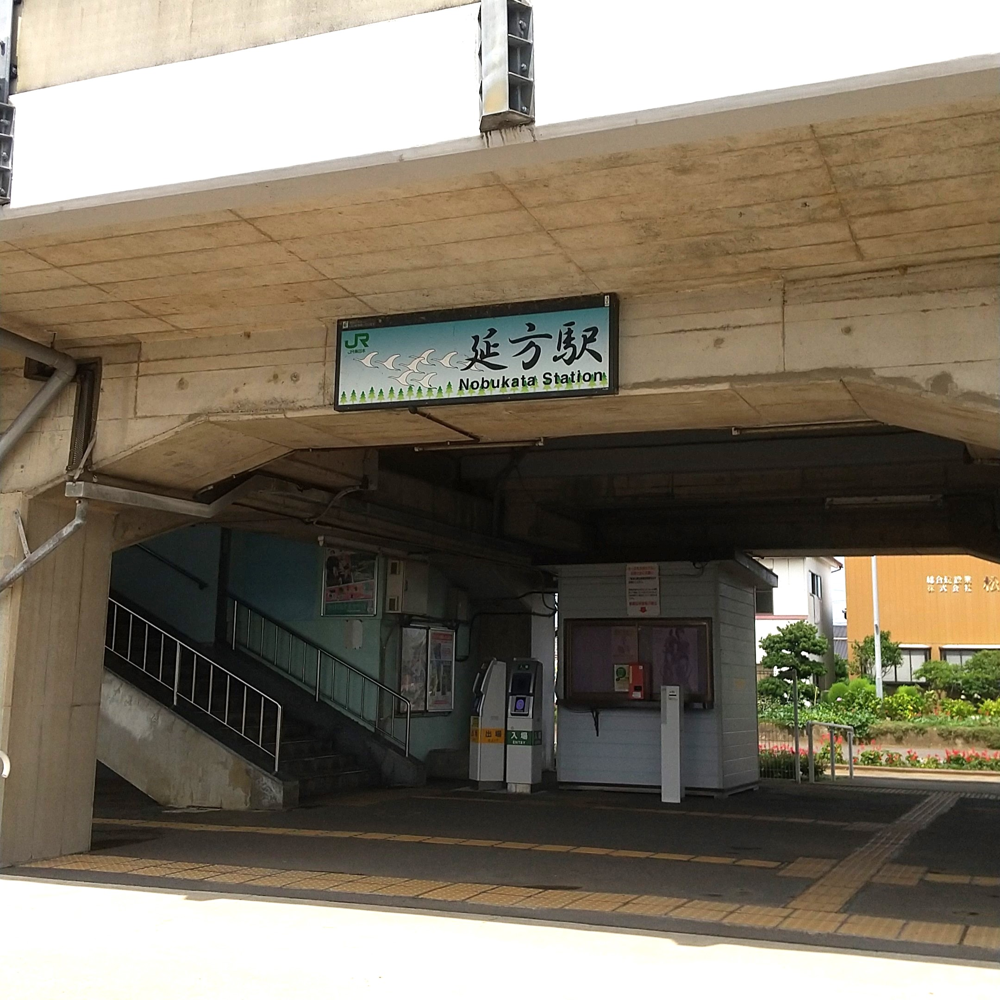
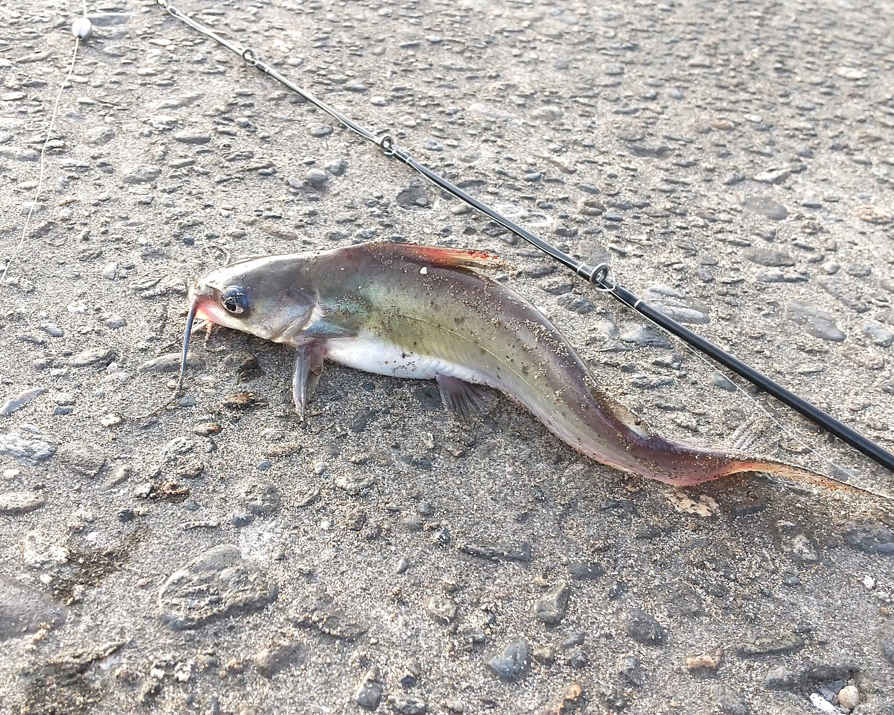
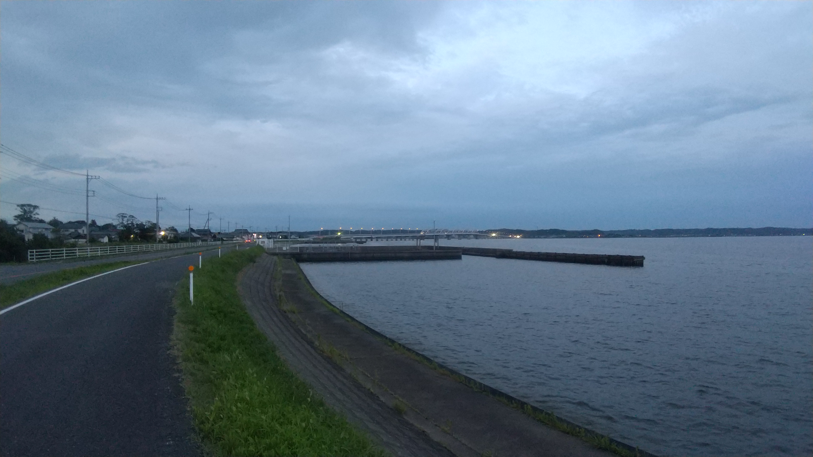
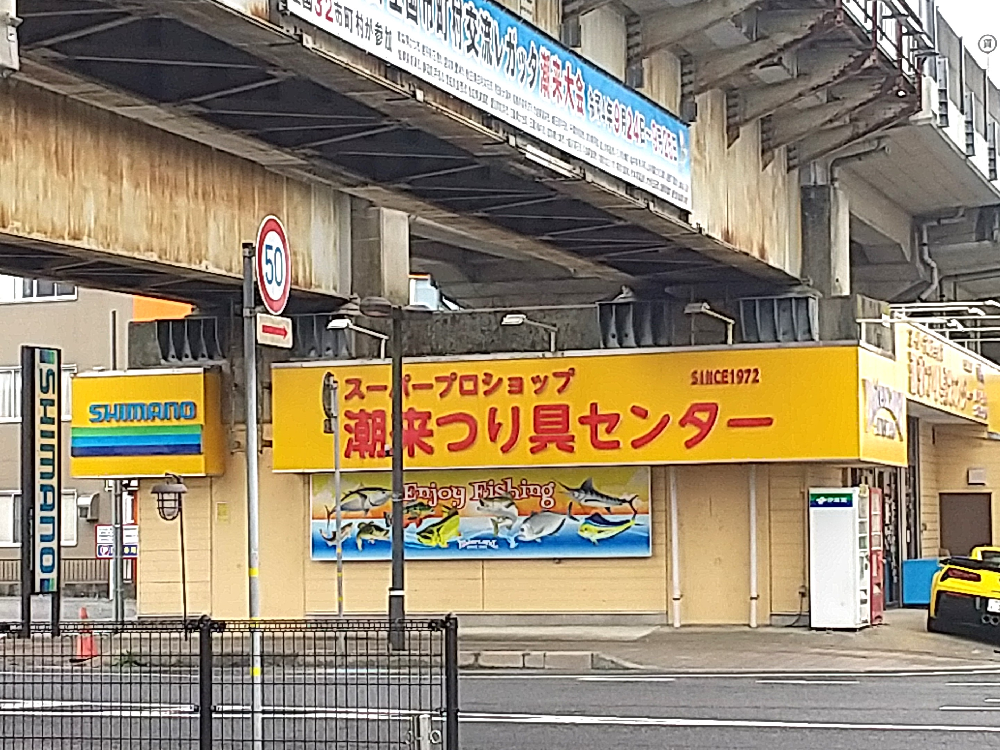

　東工大に来て、あまり実習の機会がないなーと若干の不満を持っていた筆者。筆者の所属は「土木・環境工学系」ですが、とりわけ環境について学べるような実習はほとんどありませんでした。
 （この系の専門科目で唯一の環境関連の実習授業だった2年次の環境計画プロジェクト演習は、カリキュラム改訂で今はもう無くなっています。）

　思えば、大学1年生でCOVID-19の大流行を経験し、1年次の実験科目を全く受けられなかったのが心残りだったからかもしれません（密回避のため、実験科目は抽選で受講人数を制限していました）。

　このように、「外に出られなかったなあ…」「座学だけでなく実験みたいなことも経験しておきたいなあ…」という思いでネットサーフィンをしていたところ辿り着いたのが「公開臨海臨湖実習」です。

## 生き物漬けの毎日を送る

公開臨海臨湖実習の特長は、
- 大学の専門的な機器で実習ができる!
- 他大学の学生や院生と関われる!
- 実習時間以外は自由にその場を楽しめる!（釣り具や折りたたみ自転車を持っていくと楽しい）
- 宿泊費が安い!（宿泊費の例として、2000円/日）
などなど、たくさんあります。

実習では、その大学の実験所で研究をする先生や大学生の方から、講義や手助けを受けながら生き物や環境について学んだり実験をしたりします。

筆者は霞ヶ浦近くの実験所に行きました。普段はインドア派で通学を除き電車を利用しないので、まさか行方駅が無人駅とは思いませんでした。。。

講義では首都圏の土木の民ならおなじみ [利根川東遷](https://www.ktr.mlit.go.jp/tonejo/tonejo00185.html)の話が登場しました。ただここでの説明はもっと生物寄りになるので、「治水という観点では習ったけど、生き物への影響までは頭になかったなあ」ということを考えていました。

実験では湖にいる生き物を採取したりはさみ・ピンセットを用いて解剖したりしました。
特に印象的だったのが[チャネルキャットフィッシュ](https://www.nies.go.jp/biodiversity/invasive/DB/detail/50120.html)という生命力の強いナマズさんです。特定外来生物に指定され、既存の生態系を脅かすことが指摘されています。
この子たちは釣りをするとびっくりするくらい引っ掛かります。

そして、陸に引き上げても当分は元気に動きます。解剖の際にある程度はさみを入れていてもぬるりと動くことがあるので、とてもひやひやしました。

実習がない時間は自由！筆者は散歩をしたり、他の人の夜釣りについていったりしました。

後で知ったのですが、霞ヶ浦は有名な釣りスポットだそうです。釣具店にも寄って昔の釣りの記憶を思い出しました。

公開臨海臨湖実習は東工大では単位認定されません。なのでGPAやGPTに加算されない上、東工大発行の成績証明書へ記載されません。
しかし、所属の異なる学生と生活を共にし実習することで自分の学びや将来について考えを新たにするきっかけになりました。
オンラインではなく、対面で話をする・実際に手を動かすということがやはり大切なのだなとも思いました。

## 受講までの流れ

23年度の情報が判明次第、[東工大HP＞在学生の方＞学務部掲示物情報](https://www.titech.ac.jp/students/board) から、学内限定ですが実習の受講生募集案内を見ることができます。

学部・大学院生を広く受け入れている実習が多いですが、対象学年を制限しているものもあるので注意しましょう。

申し込みは実習先の大学ではなく、東工大の方に申請します。

筆者が受講申請した際に必要だった書類は以下の通りです。

- 願書・履歴書（指定されたフォーマットから作成）
- 学業成績証明書　(TAKI PLAZAの自動発行機から入手)
- 健康診断書　(TAKI PLAZAの自動発行機から入手)
- [学生教育研究災害傷害保険](https://www.titech.ac.jp/student-support/students/disaster/insurance)の加入証明書 (東工大にメールして1週間程度でもらえる)

この中でも、保険の加入証明書は他の書類と比べ入手に時間がかかるので、早めに手続きする必要があります。

申し込みが済んだあとは抽選結果を待ちます。受け入れ先の大学の方いわく、所属大学が偏らないように広く集めているそうです。
実際、茨城の実習先には東北~九州まで様々な大学生がいました。

無事、実習の許可が下りたらメール等で実習に当たっての連絡が届きます。
着替えをスーツケースに詰めて、出発です。

## 実習先の大学例

最後に、実習を行っている主な大学を紹介します。

大学や感染症流行状況によって実習を行わない場合があるので、学務部掲示物情報の23年度受講生募集案内をよく確認してください。
各大学のウェブサイトに施設の写真や過去の実習の様子が掲載されているので、実習先を選ぶ参考になります。

- [北海道大学 北方生物圏フィールド科学センター 室蘭臨海実験所](https://www.fsc.hokudai.ac.jp/muroran/) @室蘭市
- [北海道大学 北方生物圏フィールド科学センター 厚岸臨海実験所](https://www.fsc.hokudai.ac.jp/akkeshi/) @厚岸市
- [お茶の水女子大学 湾岸生物教育研究センター](https://www.cf.ocha.ac.jp/marine/index.html) @千葉県館山市
- [茨城大学 地球・地域環境共創機構 水圏環境フィールドステーション](http://www.cwes.ibaraki.ac.jp/) @潮来市
- [名古屋大学 大学院理学研究科附属臨海実験所](https://www.bio.nagoya-u.ac.jp/~SugashimaMBL/index.html) @三重県鳥羽市
- [信州大学 湖沼高地教育研究センター](https://www.shinshu-u.ac.jp/faculty/science/inlandwater/) @諏訪市
- [広島大学 大学院統合生命科学研究科附属臨海実験所](https://www.hiroshima-u.ac.jp/rinkai/course) @尾道市
- [金沢大学 環日本海域環境研究センター臨海実験施設](http://rinkai.w3.kanazawa-u.ac.jp/) @鳳珠郡能登町
- [東京大学 三崎臨海実験所](https://www.mmbs.s.u-tokyo.ac.jp/wp/) @神奈川県三浦市
- [神戸大学 内海域環境教育研究センター・マリンサイト](https://www.research.kobe-u.ac.jp/rcis-kurcis/kyoten2020/index.htm) @淡路市
- [筑波大学 下田臨海実験センター](https://www.shimoda.tsukuba.ac.jp/index.html) @静岡県下田市
- [京都大学 フィールド科学教育研究センター舞鶴水産実験所](https://www.maizuru.marine.kais.kyoto-u.ac.jp/jisshuu/jisshusei.html) @舞鶴市
- [京都大学 フィールド科学教育研究センター瀬戸臨海実験所](https://www.seto.kyoto-u.ac.jp/smbl/index.html) @和歌山県西牟婁郡白浜町

---
## LANDFALLについて

このブログは、東工大生協の学生団体「[LANDFALL](https://landfaller.com)」の部員が執筆しました。

LANDFALLは、学生のための情報冊子を作成しているサークルです。

主な制作物は、毎年新入生に配布している「[TOKO WALKER](https://landfaller.com/category/tokowalker/)」という冊子です。新入生が大学生活のスタートダッシュを切ることができればとの想いで制作しています。

また、LANDFALLは[研究室紹介記事](https://landfaller.com/magazines)も作成しております。「LANDFALL」は研究室紹介冊子として1986年に創刊され、現在93号まで発行されています。オンラインで記事を公開しておりますので、ぜひご覧ください。
