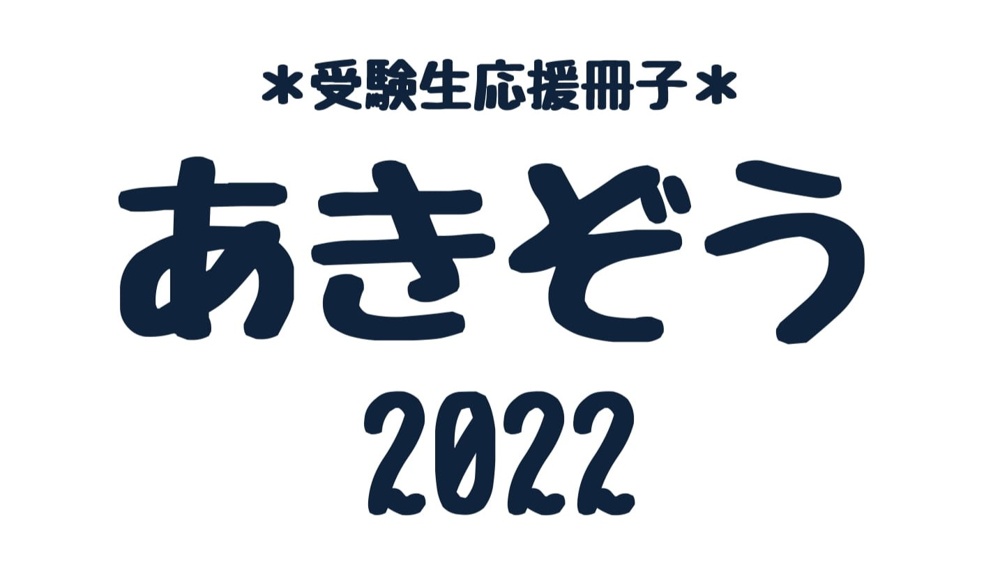

# はじめに
　数年ぶりの工大祭が10/29-10/30に開催され、無事に終了しました。今回LANDFALL編集委員会では、輪投げ屋台の実施と受験生向け冊子「あきぞう」の無料配布を行いました。

結果、多くの方に「あきぞう」を手に取っていただきました、ありがとうございました。工大祭へ来場できなかった方にもぜひご覧いただきたいということで、pdf版を公開いたします。

過去のAO入試の合格体験記をはじめとした受験体験記は[他のblog](https://landfaller.com/tags/%E5%90%88%E6%A0%BC%E4%BD%93%E9%A8%93%E8%A8%98/)にもあるので、ぜひ合わせてご覧ください。

# 目次
- [学院紹介](./real2022akizou-1-9.pdf)
- [合格体験記](./real2022akizou-10-24.pdf)
- [受験遠征のポイント](./real2022akizou-25-28.pdf)

---
### LANDFALLについて

このブログは、東工大生協の学生委員会の団体「[LANDFALL](https://landfaller.com)」の部員が執筆しました。

LANDFALLは、学生のための情報冊子を作成している学生団体です。

主な制作物は、毎年新入生に配布している「[TOKO WALKER](https://landfaller.com/7a895fee2b767b2554cee0ff6a428902/TOKOWALKER2021.pdf)」という冊子です。新入生が大学生活の良いスタートダッシュを切ることができればとの想いで制作しています。

また、LANDFALLは[研究室紹介記事](https://landfaller.com/magazines)も作成しております。「LANDFALL」は研究室紹介冊子として1986年に創刊され、現在93号まで発行されています。オンラインで記事を公開しておりますので、ぜひご覧ください。

また、この記事を読んだ受験生の皆様が東工大に入学した際には、是非[LANDFALLの部室](https://landfaller.com/blogs/clubroom/)にもお越しください。