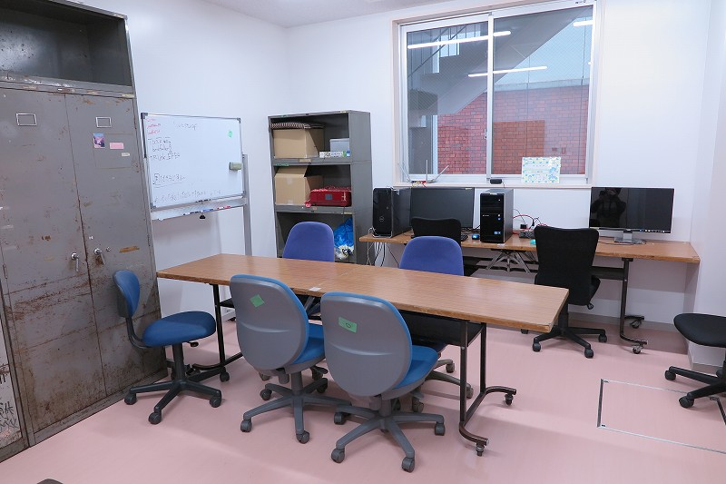
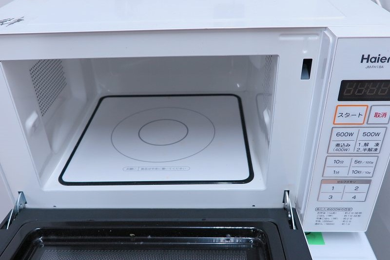
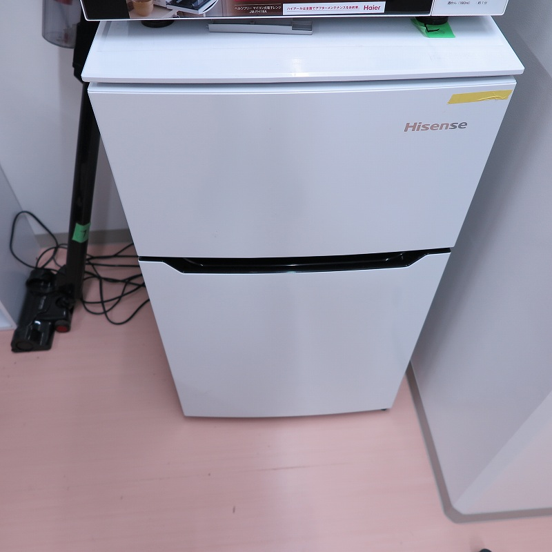
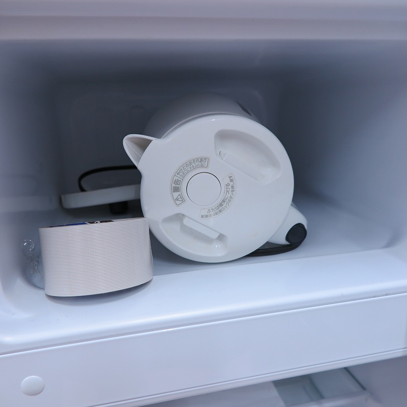
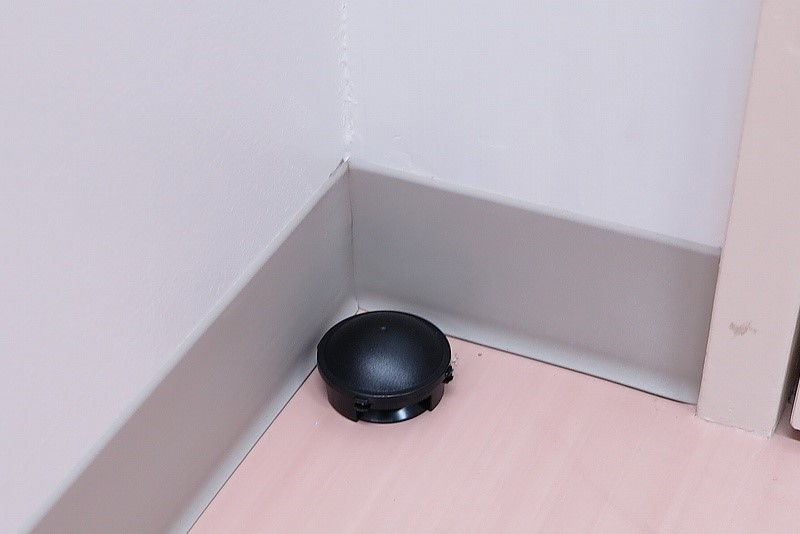
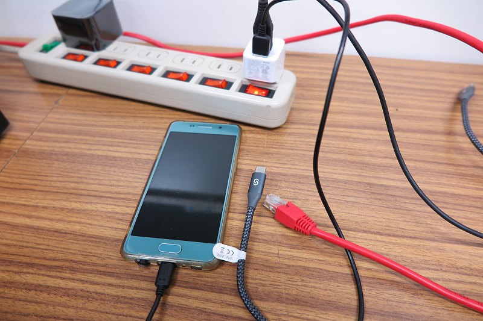
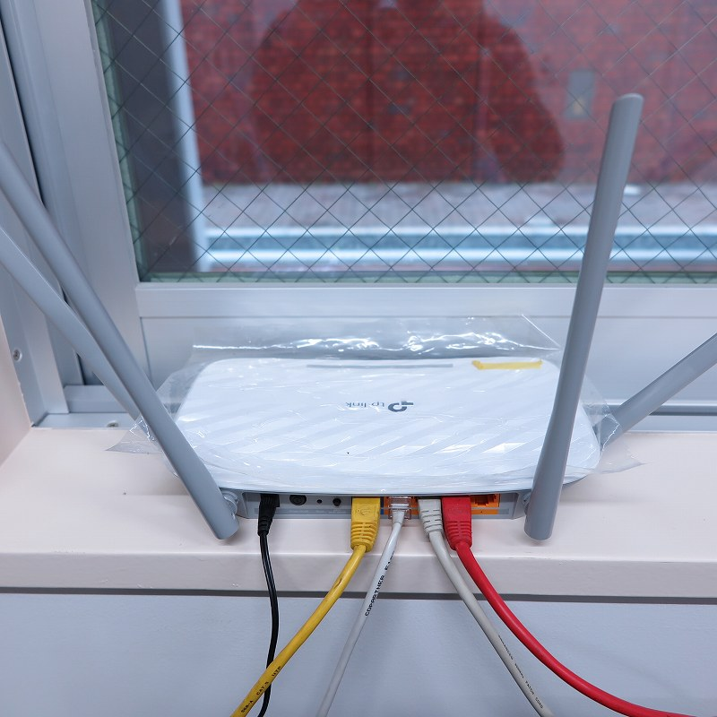
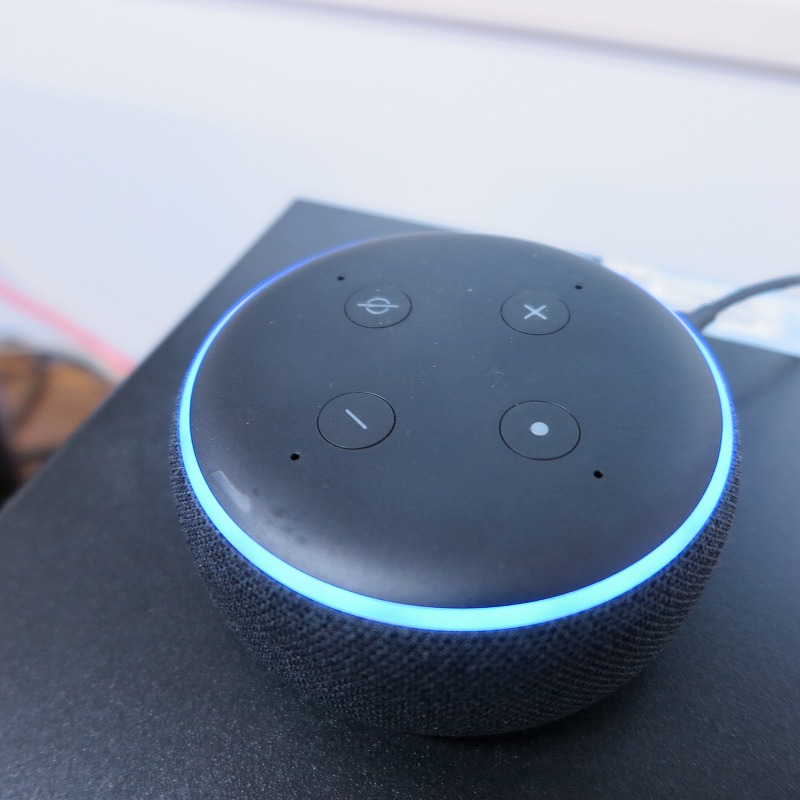
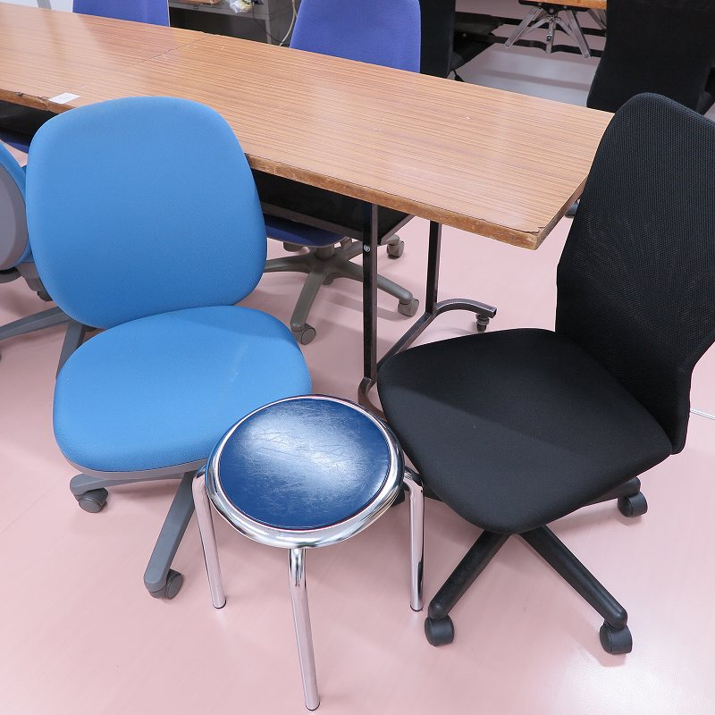
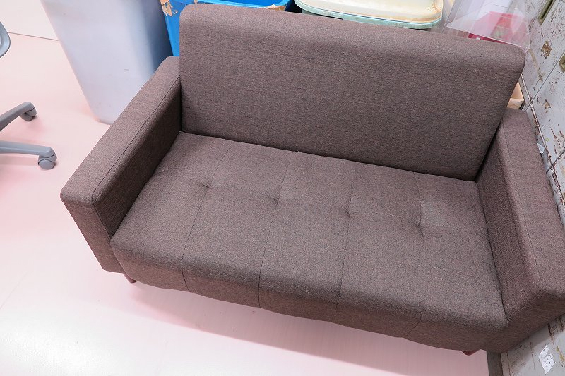

## １：憧れの新築

はじめまして、LANDFALL編集委員の上田です。「インターネットでの情報発信を行おう」ということで本日より不定期ではありますが部員ブログを掲載していきたいと思います。その部員ブログ第１弾として今回は、ちょうど**先月に新しくなったばかり**の快適な部室を紹介します。

 <iframe src="https://www.google.com/maps/embed?pb=!4v1625059557485!6m8!1m7!1s5kWgGl_C_YbSmj4cmIqlZg!2m2!1d35.60367709841587!2d139.6844598755964!3f233.55186170222984!4f2.6917126388756145!5f0.7820865974627469" width="450" height="450" style="border:0;" allowfullscreen="" loading="lazy"></iframe>

今までは第一食堂地下１階の、かなり奥まった部分にある薄暗い部屋でしたが、第一食堂建て替え計画に伴って南３号館(セブンイレブンが入っている建物)の隣に新たに建てられた新サークル棟の1階に引っ越しました。そう、**新築です**(残念ながらストリートビューではまだ更地ですが)。

そして、新部室の全体像がこちら。広々、というわけではありませんが新築なので非常にキレイです。ちなみに、部室は生協本部の奥にあるので、部室を利用したい場合は生協職員の方に声をかけて鍵を開けてもらいます。部員は生協本部の対応時間内であれば自由に利用することができます。というわけで次は部室に備え付けられた**充実の設備**を見ていきましょう。

## ２：冷蔵庫から電気ケトル？

まずは入口から見て右手から。こちらには電子レンジが備え付けられてあります。しかも**フラット式で庫内広々**な、ちょっといいやつです。これで**大きめの弁当も温め放題**です。

電子レンジの下には冷蔵庫があります。こちらも部員は自由に使用できますが、**きちんと管理しないと他人に勝手に食べられる**危険性があるので注意しましょう。冷蔵庫の中身は引っ越し時に一掃し、以降電源が切られたままなのできれいなはず…

…庫内からなぜか**電気ケトルとガムテープ**が出てきました。シュールです。あっ、もちろんこの電気ケトルも部員は自由に使えますのでいつでも淹れたてコーヒーが楽しめます(コーヒーセットもどこかにあるけど長年使われていません)。

## ３：Gの対策も万全！

また、部室にはブラックキャップが多数設置されており、**「G」への対策も万全**ですのでご安心ください。

## ４：ここはまるで大学にある”サテライトオフィス”

次に、奥に設置された机を見ていきましょう。こちらには現代人の命綱である**USB充電器**が設置されています。各種充電ケーブルも取り揃えておりますので、いつでもすぐに各種機器を充電できます。さらに、テーブルタップや有線LANも用意しておりますので、PCを利用する際も快適です。

この部室ではTokyo Tech Wi-Fiが使用できますが、それとは別に**11ac対応のルーター**が設置されています。こちらの回線は**実測で上り・下り共に100Mbps前後**が得られ、さらに**面倒なログインも必要ない**ので快適なインターネット環境をお楽しみいただけます。

さらに、何と**Amazon Alexa(Echo dot)**まで備え付けられています。休み時間に音楽をかけながら一息ついたり、音声アシスタントとの会話を楽しんだりできます。ちなみに筆者は**「OK Google」とか言っていじめてました**。

また、**何かにつけてこだわりの強い東工大生**のために多種多様な椅子をご用意しております。一般的なオフィスにある有名メーカーの椅子、Amazonとかで売っている、とにかく安価だけど割と使える椅子、気楽に使えるスツール、

さらにはソファーもあります。ぜひ、あなたの「お気に入りの一脚」を見つけてください。

## ３：ぜひあなたもLANDFALLへ！

ルームツアー、お楽しみいただけたでしょうか。そして、LANDFALLの活動に参加したいという方はもちろん、「部室が見てみたい」なんていう方もぜひ一度、**[LANDFALL公式Discordアカウント](https://discord.gg/v5YGJnyG)**へ。([LANDFALL公式twitter](https://twitter.com/landfall_pr)へのDMでも構いません♡)

というわけで、皆さんのご参加を心よりお待ちしております❕