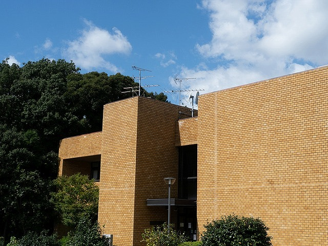
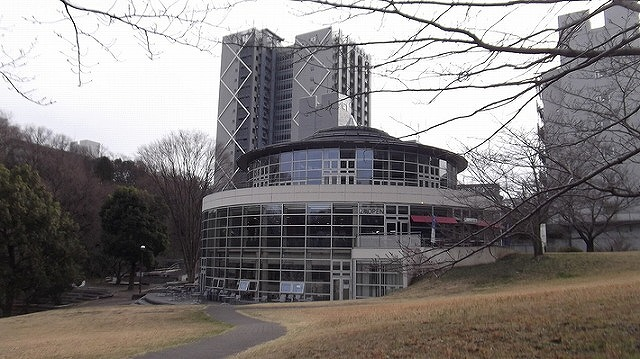
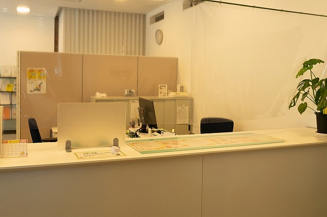
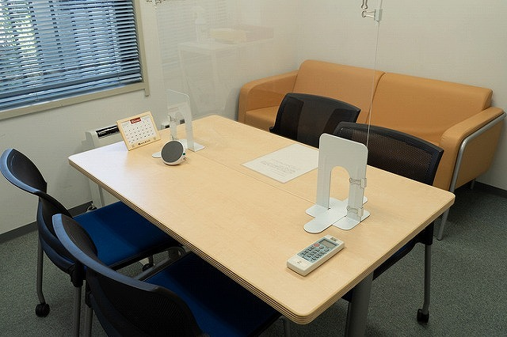
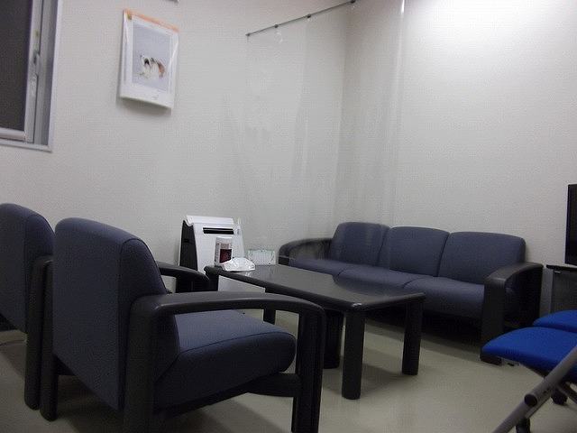
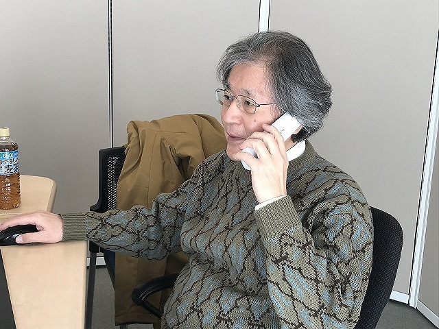

## 東工大生の身近な相談相手
⼤学⽣になって様々なことに夢が膨らむ半⾯、履修や⼈間関係、サークルなどで悩むことも多い新⼊⽣。今回は、そんな新⼊⽣に勧めたい「東⼯⼤⽣の⾝近な相談相⼿」、学⽣相談室を紹介します。

## 相談先を案内する「道案内係」
⼤学には様々な相談窓⼝があり、「どこに相談すればいいのか」と迷うこともあるかも知れません。例えば、保健管理センターではカウンセラーの資格を持った⽅がメンタル⾯でのケアを担当していますが、⾃分にカウンセリングが必要なのかどうかの判断は⼀⼈では難しいものです。それ以外にも学⽣⽀援課・⽣協など相談窓⼝はたくさんあって迷ってしまいます。学⽣相談室ではどこに相談すべきかの「道案内」を⾏っていますので、そんな時はまず学⽣相談室に連絡してみましょう。

また、「こんな質問でもいいのか」と思うこともあるかもしれませんが、学⽣相談室にはあらゆる質問が来るとのことなので、特に⼀回も相談したことがない、どこが窓⼝かわからないといった新⼊⽣の⽅はぜひ気楽に連絡してみましょう。

## 相談⽅法は様々
大岡山学⽣相談室は⼤岡⼭キャンパスの隅にひっそりと佇む80年記念館内にあります。80年記念館は図書館裏⼿の橋を渡った保健管理センターの隣にあります。また、すずかけ台学生相談室はすずかけ台キャンパス⼤学会館内にあり、どちらも学⽣からの相談を受け付けています。今回は、大学1年生が利用することの多い大岡山キャンパス学生相談室をメインにご紹介します。

大岡山キャンパス 80 年記念館

すずかけ台キャンパス大学会館

80年記念館に⼊って左⼿が大岡山学⽣相談室⼊⼝です。キャンパスの端にあることも相まって、⾮常に静かで落ち着いた雰囲気の部屋になっています。

大岡山学生相談室 受付カウンター

⼊ってすぐのところには受付のカウンター、その隣の明るい窓辺には机や本棚が置かれています。今回はここでお話を伺わせていただきました。

 と電話相談デスク 河内アドバイザー (右)")

室長の道又先生 (左) と電話相談デスク 河内アドバイザー (右)

もちろん相談内容を他⼈に知られたくないという⽅のためにパーティションで仕切られた空間や個室も⽤意されています。学⽣相談室では予約なしでの相談も受け付けていますが、相談員や部屋には限りがあるため予約をお勧めしています。

大岡山面談室の様子

すずかけ台面談室の様子

予約は直接訪問する以外にも、メール(大岡山：<a href="gakusei.soudan1@jim.titech.ac.jp">gakusei.soudan1@jim.titech.ac.jp</a>　すずかけ台：<a href="gakusei.soudan2@jim.titech.ac.jp">gakusei.soudan2@jim.titech.ac.jp</a>) や電話(大岡山：03-5734-2060　すずかけ台：045-924-5888)でも受け付けています。
また、顔を合わせて話すのに抵抗があるという⽅や⼤学に⾏く機会が少ないという⽅のために電話相談デスクが開設されています(電話：03-5734-2134（内線）2134)。匿名での相談も受け付けていますので、訪問するのは敷居が⾼いという⽅にもおすすめです。

電話相談デスク上野修一アドバイザー

## 東⼯⼤教員が相談員
　学⽣相談室は臨床心理士も相談にのっていますが、基本東⼯⼤教員が相談員です。例えば、今回お話を伺った電話相談デスクの河内宣之アドバイザーも化学の領域で⻑らく教鞭をとられた方です。「相談員」というよりは「先⽣」といった印象もありましたが、とても話しやすかったです。東⼯⼤教員なので、履修や研究室、院試などについての悩みに対して学⽣の⽴場に⽴って具体的なアドバイスをいただけるのも⼼強いですね。
また、相談員は所定の研修を受けた⽅が担当していますし、もちろん秘密は守られますので安⼼して利⽤できます。
まずは、こちらのリンクから<a href="https://www.titech.ac.jp/student-support/students/counseling/guidance">学生相談室</a>と<a href="https://www.titech.ac.jp/student-support/students/counseling/telephone">電話相談デスク</a>のウェブページをチェックしてみてください。

- 学生相談室受付
    - 大岡山
        - 80 年記念館 1 階 102 号室
        - Tel：03-5734-2060
    - すずかけ台
        - すずかけホール　H2 棟 1 階
        - Tel：045-924-5888