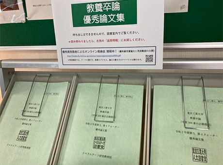
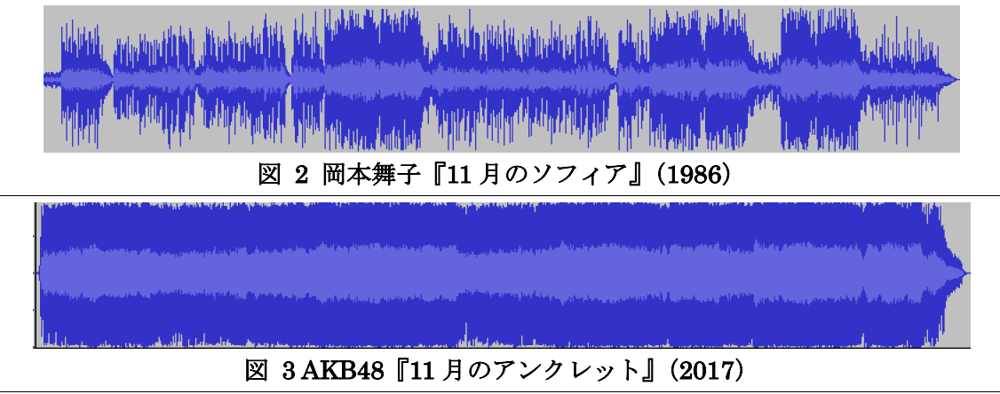
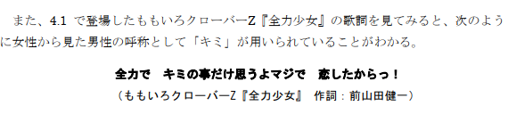
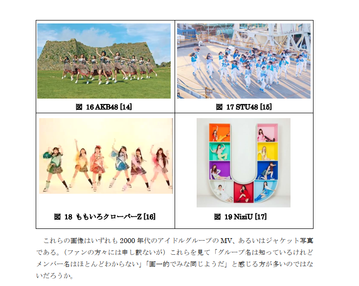
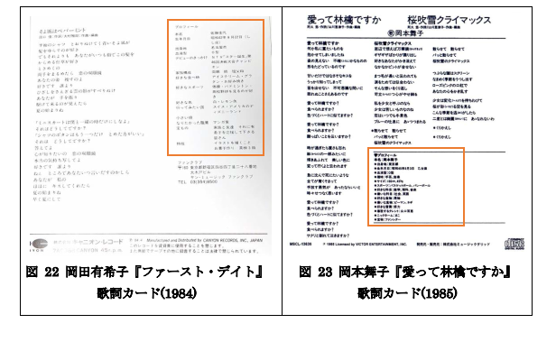
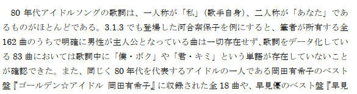
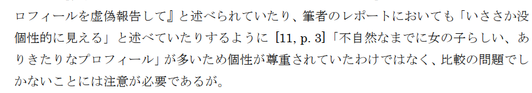
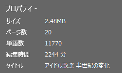

## 「教養卒論」って何？

東工大では、学士課程３年目秋に履修する必修科目「教養卒論」において、リベラルアーツ教育の集大成として**5000～10000字**の論文を執筆します。<a href="https://educ.titech.ac.jp/ila/news/2019_01/056723.html">東工大のHP</a>には「学士課程教養教育の集大成」とか「志」とか、なんか**意識高い感じの言葉**が並んでいますが、学生からすれば**5000～10000字という長文を書かないと卒業できない**ということで正直なところ**しんどいな～**と思うのも無理はないと思います。

また、教養卒論のテーマ設定は「**自分の専門分野やこれまで学修してきた教養や様々な経験を題材にして、その社会的な意味や影響といった主題を自ら設定し探究する論文**」という感じのかなり抽象的なものになっており、実際**書く内容の自由度は非常に高い**ので逆に**テーマ設定に迷う**という人も多いでしょう。

そこで今回は、これから教養卒論を執筆する予定の東工大生に向けて、教養卒論で優秀賞を受賞した筆者が**どのようにテーマを選定し、執筆したのか**を書いていこうと思います(実際は部内で「優秀賞取ったぜ、イェ～イ」って言ったら「じゃあ記事にしろ」って言われただけ)。最後に**論文の全文も掲載しています**。

ちなみに、「優秀賞」ってなんかすごそうですが**21あるクラスそれぞれから1~2名**、合計で**40名程度**が選ばれるのでそこまで狭き門ではないです。やっぱり苦労して書いた文章が評価されると嬉しいので、これから教養卒論を執筆する学生の皆さんも優秀賞を狙ってみてはいかがでしょうか。

## テーマ選定：もはや「自由の刑」

教養卒論を執筆するにあたってまず初めに当たる壁、それは**テーマ選定**です。先ほども述べましたが、教養卒論のテーマとして与えられるのは

**
自分の専門分野やこれまで学修してきた教養や様々な経験を題材にして、 その社会的な意味や影響といった主題を自ら設定し探究する論文
**

この~~わけわからん~~一文だけです。ここから具体的に何について書くのかを考えるのは至難の業。実際、筆者もかなり悩みました。

### 過去の論文を読んでみる

優秀論文集(<a href="https://educ.titech.ac.jp/ila/news/2022_04/062345.html">東工大HP</a>)より引用

そんなときはまず**過去の優秀論文**を読んでみましょう。過去の優秀論文は**リベラルアーツ図書館**(大岡山キャンパス 西9号館E棟1階114号室)で読むことができますし、過去２年分くらいの優秀論文は**発表動画や論文を見ることのできるリンクが講義で示される**と思うので、そこから教養卒論の全体像をつかんでみると何か思いつくかもしれません…

と、思うじゃん？

これが優秀論文を読むと、その内容の多種多様さに圧倒されて**余計に何を書いたらいいのかわからなくなる**んですよね。それでもやはり過去の論文を読むことである程度雰囲気や全体像をつかむことができますし、真似できる点も多くあると思うのでまず初めに過去の論文を読むのはいい選択だと思います。

筆者は過去の優秀論文や同じクラスの人のテーマを見ていて、優秀賞を取るような教養卒論は次のような**3つに分類される**場合が多いと思いました。

1. ゲームやアニメ、音楽などの娯楽コンテンツを、**~~オタク特有の~~卓越した知識量で分析する**
2. **自身の専門分野**や**大学での学び**に関連した事象について、**普段とは違う視点**で分析する
3. コミュニケーションや感情といった**抽象度が高いテーマ**について、**理論的思考力＋文章力**で**理路整然と**分析する

まあ、だからといってテーマが決まったわけじゃないんですが…

### 最後は「書きたい」と思えるテーマを

なんか図らずともテーマがなかなか決まらない様を長文で再現してしまいましたが、最終的に筆者がテーマを決めるにあたって最も重視したことは

書きたい、と思えること

でした。いくら「これなら優秀賞取れそう」とか「文字数稼げそう」とか思っても**積極的に「書きたい」と思えなければ5000文字以上の長文を書くのは苦痛**ですから。そこで、筆者は**自分の趣味**である**80年代アイドル歌謡**を題材とすることに。

そして、ここから更にテーマを具体化していきます。ここで筆者は、単に80年代アイドル歌謡のみについて取り上げたとしても私の知識量では他の人を上回るような論文にはならないと考え、じゃあどうすれば他の人を上回れるか、つまり**自分の強み**は何なのかを考えました。**ウザいビジネス用語で言えば「コアコンピテンシー」ですね！！**(ちょっと違う気もするが)

で、最終的に「最近は割と2000年代のアイドル歌謡も聞いているので**広範な年代に渡るアイドル歌謡の分析であれば十分勝負できる**のではないか」という結論に至りました。圧倒的な知識量を誇る「昭和歌謡オタ」や「(最近の)アイドルオタ」はたくさんいますが、その両方に興味がある人って意外と少ないので。

というわけで、筆者の教養卒論のタイトルは「アイドル歌謡の時代変化を分析する」ということで以下のように決定しました。

**
アイドル歌謡 半世紀の変化
**

実際、自身の趣味に関連する内容をテーマとする人は多いので、まずは趣味を思い浮かべてみるのはいいかもしれません。ただ、「東工大」という性質からか**サブカルに関する論文が多くなる傾向**(特にゲームが多い)があるので優秀賞を狙う場合は避けたほうが競争が少なくていいかもしれません。

## 執筆に取り掛かる

無事テーマが決まったので、次は執筆に取り掛かります。

### 見えないものを「見える化」する

まずはテーマをより具体化していきます。筆者のように「音楽」のような**目で見えないもの**について文章で論じる場合、いかにして**可視化**するかが重要になってきます。また、**多元的な分析**を行ったほうが面白い文章ができそうです(あと文字数も稼げる)。そこで、筆者は以下のように大きく２つに分けて分析を行うことにしました。

- **音声信号波形**の分析
- **歌詞や歌唱映像**の分析

音声信号波形の分析では、例えば次のように音声を「波形」という形で可視化することで**時代を追うごとに音圧が大きくなることを視覚的に説明**できるようにしました。こうしてみるとAKBの曲って本当に音圧マシマシだな…

また、歌詞や歌唱映像の分析ではなんか真面目な論文とは思えないような言葉・画像が並ぶことに…

こんな感じで視覚情報を使えば、「何となく最近の曲って音圧高いな～」とか「歌詞の内容に偏りがあるような」といった感覚的なことも文章で説明できます。

また、この２つの項にわけることで「波形」という**理系っぽい分析**と「歌詞の内容」や「見た目」といった**文系っぽい分析**の両方を行うことができ、**「文系」と「理系」の融合が大好きな東工大リベラルアーツ教育院の評価も爆上がり**ですね！(知らんけど)

### 「オタクの力」を発揮しつつ「一人語り」にならない

そして、最後は**オタクの力**で論文の内容を深いものにしていきましょう。

例えば、筆者の場合は「ストリーミングが当たり前世代」でありながら**やたらとCDを持っている**という特性を生かして**付属の歌詞カードまで分析対象**にしました。

それ以外にもしれっと**ある１人の歌手の曲を162曲**も所有していて、うち**83曲はなぜか歌詞がデータ化**されていたり…

なぜか**自分自身での先行研究があったり**と、ちょいちょい「オタク感」が出ている気がします。

オタクというのは基本**話し始めたら止まらない**ですから、オタクの情報量を使えば論文の文字数を稼ぐことは容易です。しかし、同時に **「オタクの一人語り」にならないように気を付ける**必要があります。例えば、筆者の場合は次のような点に注意し、対策を行いました。

- 自分の**好みによる偏り**が生じないようにする
 - →分析対象の曲を**一般的に人気がある(あった)ものの中から選ぶ**ようにした。
 - →音楽チャートや紅白歌合戦の過去データなどを利用した。

- 読者は**80年代アイドルなんて知らない可能性が高い**
 - →画像や脚注を利用して読者が理解しやすいよう配慮した。

あと、文章を書く際の一般的な注意点として次のようなことも意識しました。
- **文頭と文末の整合性**に注意する
 - →文章が長くなってくるとついつい構造が崩れがちなので、「なぜならば」で始まったのに文末は「～であることが分かる。」みたいなことがないようにする。
- 書いた文章は最低でも**一晩は寝かせる**
 - →翌日になって読み直してみると **「何だこれ？」** ってなる場合が多々あるので鉄則。

そんなこんなで書き進めること**約30時間**、無事**1万文字を突破**しました。決して楽ではありませんでしたが、自分の趣味のことなので割と楽しかったです。

ちなみに、このページの文字数は**約3000文字**なので、もうちょっと頑張れば **「教養卒論の書き方」っていう教養卒論が完成します**。実際に「教養卒論についての教養卒論」を書いている人もちらほらいるのでテーマの一つとしてはアリです。

最後に、筆者の論文を読みたいという方はこちらから。正直なところ、結論がとっ散らかっているのが今一つなんですが…

＜論文リンク＞ 
[優秀賞を取った教養卒論を実際に読んでみる](ila-thesis/thesis.pdf)