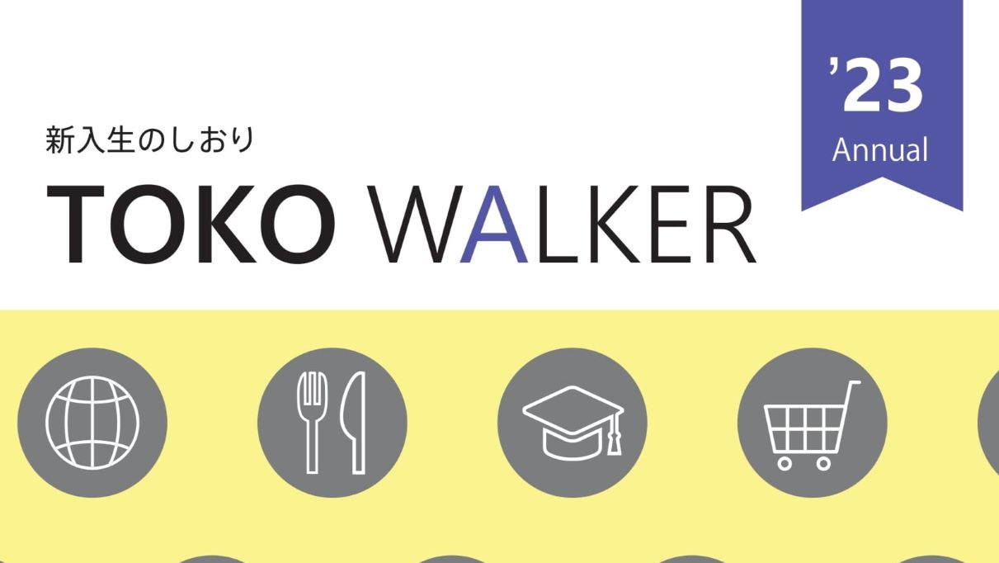

今年もTOKOWALKERが完成しました。2023年のTOKOWALKERもぜひご覧ください。

## 目次

- [**ご挨拶**](./tokowalker23_5-1.pdf)
- [**これからの予定**]
    - はじめに
    - 入学式
    - 1年間の流れ
- [**キャンパス案内**](./tokowalker23_5-2.pdf)
    - 大岡山周辺マップ
    - 大岡山キャンパスマップ
    - すずかけ台キャンパスマップ
    - 付属図書館に行ってみよう
- [**生協を利用しよう!**](./tokowalker23_5-3.pdf)
    - 大岡山第一食堂
    - 大岡山第二食堂
    - すずかけ台食堂
    - 大岡山フードショップ
    - 大岡山購買
    - すずかけ台購買
    - 生協とは
    - 総代
    - 共済
    - 学食マネー
    - 新入生サポートセンター
    - LANDFALL編集委員会
- [**授業等紹介**](./tokowalker23_5-4.pdf)
    - 単位について
    - 学院紹介
    - 授業紹介
- [**大学生活**](./tokowalker23_5-5.pdf)
    - 東工大用語集
    - カウンセラーの紹介
    - 学生相談室の紹介
    - 広いキャンパスで迷わないために
    - サークル
    - 工大祭
    - アルバイト
    - 飲酒
    - 運転免許
- [**編集後記**]

今回も多くの方々から取材や寄稿のご協力をいただきました。この場を借りてお礼申し上げます。

来年度のTOKOWALKERを作ってみたい、という東工大生を募集しています。ご興味がございましたらぜひご連絡ください。

## LANDFALLについて

このブログは、東工大生協の学生団体「[LANDFALL](https://landfaller.com)」の部員が執筆しました。

LANDFALLは、学生のための情報冊子を作成しているサークルです。

主な制作物は、毎年新入生に配布している「[TOKO WALKER](https://landfaller.com/category/tokowalker/)」という冊子です。新入生が大学生活のスタートダッシュを切ることができればとの想いで制作しています。

また、LANDFALLは[研究室紹介記事](https://landfaller.com/magazines)も作成しております。「LANDFALL」は研究室紹介冊子として1986年に創刊され、現在93号まで発行されています。オンラインで記事を公開しておりますので、ぜひご覧ください。